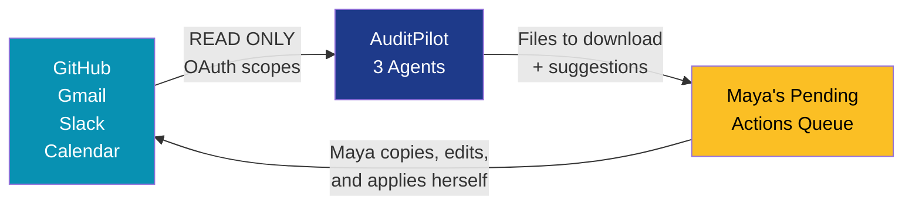
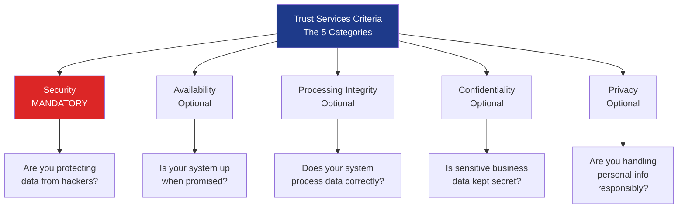
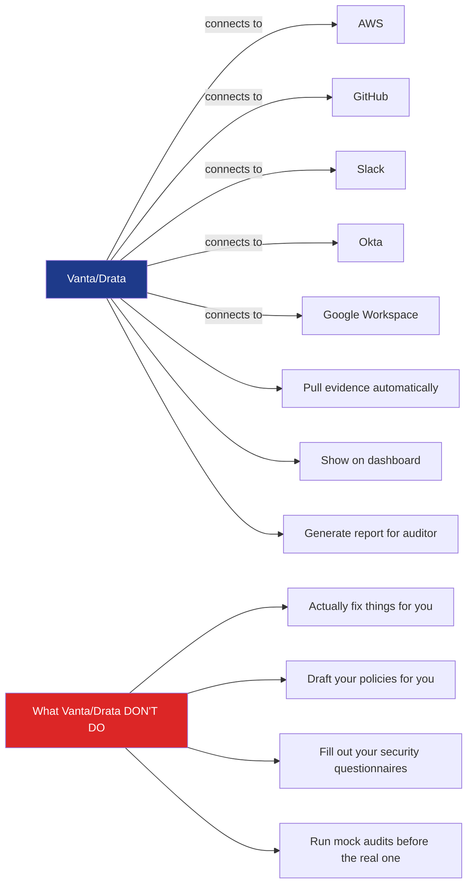
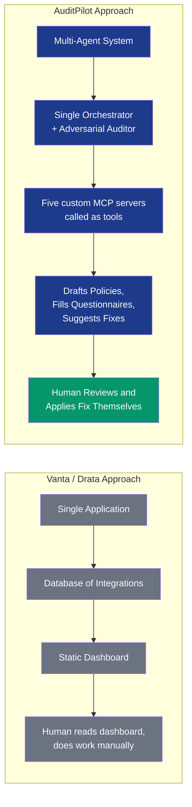

# AuditPilot Foundations: What You're Actually Building and Why

This document is your foundational knowledge before you write a single line of code. By the end, you will understand what SOC 2 is, why companies care about it, what people do today to handle it, where the pain is, and exactly how AuditPilot fits into that world. Every page you build and every agent you write will make sense.

There is no jargon you need to look up later. Everything is explained in order.

---

## Part 0: The Most Important Rule (Read This First)

Before anything else, understand one thing about AuditPilot:

**AuditPilot reads your tools. It produces files and suggestions. It never reaches back out to change anything in your tools.**

That sentence is the whole security model. Read it twice.

When Maya signs in, AuditPilot asks for **read-only** access to her GitHub, Gmail, Slack, and Calendar. The OAuth dialogs literally say "read-only." She can revoke access with one click. AuditPilot cannot push code, send emails, post messages, or modify settings. It can only look.

The agents take what they read and produce two kinds of output:

**Files Maya downloads.** The orchestrator fills 70% of a SIG-Lite XLSX with cited answers and gives Maya the file. It writes an Incident Response Plan and gives Maya the document. These are just files. The agent isn't "reaching out" anywhere. Maya downloads them and uses them however she wants.

**Suggestions Maya acts on herself.** When AuditPilot detects branch protection got disabled on `main`, it puts a card in the Pending Actions queue saying "Branch protection disabled on main. Here is the GitHub setting to flip: [link]. Click to open in GitHub." Maya clicks the link, lands on the right GitHub settings page, flips the checkbox herself, and clicks "Mark as done" back in AuditPilot. When AuditPilot detects an access review is overdue, it drafts the email Maya should send to managers. Maya copies the draft, pastes into Gmail, edits if needed, and sends it herself.



Here is the difference made simple, with examples:

| What AuditPilot does | What AuditPilot does NOT do |
|---|---|
| Detects branch protection is off and shows Maya the GitHub setting to flip | Calls GitHub API to flip the setting |
| Drafts an email reminder to managers about access reviews | Sends the email through Gmail |
| Drafts a Slack message reminding someone about MFA | Posts the message in Slack |
| Detects a vendor DPA expires in 14 days and drafts a renewal email | Sends the renewal email |
| Drafts the Incident Response Plan as a downloadable Word doc | Publishes the policy anywhere |
| Fills 70% of a SIG-Lite questionnaire as a downloadable XLSX | Submits the questionnaire to the vendor |
| Logs that Maya marked an action as done | Verifies the action was actually applied (Maya self-confirms) |

**Why we built it this way.** This is not a limitation. This is the correct design and exactly how Vanta works. On Vanta's own SOC 2 product page they write: *"Vanta connects read-only to your cloud, identity, code, and device tools."* For fixes Vanta generates *"remediation snippets so developers can resolve failing tests fast."* The developers apply the snippet. Vanta doesn't.

There are four reasons every serious compliance tool works this way:

1. **Compliance requires human judgment.** SOC 2 control decisions need a human to apply context. AICPA guidance is explicit on this. An agent that auto-applies fixes would be a red flag to any security director.
2. **Write access is dangerous.** A bug in an agent that has write access to GitHub could disable security in production. Read-only removes that whole class of risk.
3. **Write OAuth scopes scare users.** Write access dialogs are slower to approve and require more security review. Read-only dialogs are one-click.
4. **It removes legal exposure.** No "the AI changed my production firewall and broke things" liability. No AICPA UPAct concerns.

**The reading frame for the rest of this document.** When you see "the agent sends an email" or "the agent fixes GitHub" anywhere later in this document, mentally translate it to "the agent drafts the email and Maya sends it" or "the agent shows Maya which GitHub setting to flip and she flips it." Files are different. When the doc says the agent produces a questionnaire XLSX or a policy document, it really does just produce a file. No "reaching out" to anything.

Now you understand the model. The rest makes sense in this frame.

---

## Part 1: The Story That Started All of This

Imagine Maya. She is a founding engineer at a 40-person SaaS startup in Boston that sells a project management tool for marketing teams. The product is good. Customers love it. Revenue is growing.

One Monday morning, Maya gets pulled into a meeting with her CEO. He looks worried.

> "We just got pulled into procurement at a Fortune 500 retailer. They want to buy our software for their entire marketing org. The deal is worth four hundred thousand dollars a year. But there is one problem. They will not sign anything until we send them our `SOC 2 report` and answer their two-hundred-question security questionnaire. They want it by Friday."

Maya stares at him. She does not have a `SOC 2 report`. She does not even fully know what one is. And the deadline is four days away.

This is not a rare scenario. This happens to thousands of startups every month in the United States. The bigger your customer is, the more likely they will demand this from you before they pay. **This is the world AuditPilot lives in.**

---

## Part 2: What is SOC 2, Really?

Let me explain SOC 2 the way I would explain it to a friend over coffee.

### The plain English version

SOC 2 stands for "System and Organization Controls 2." It is a security framework. Think of it like a quality stamp for software companies. When a company has a `SOC 2 report`, it means an independent expert (a CPA, the same kind of professional who does taxes) came in, looked at how the company handles customer data, and wrote a public report saying: "Yes, this company actually does what it says it does to keep data safe."

It is not a law. The government does not require it. There are no fines if you do not have one. But here is the catch. **Big companies refuse to buy software from vendors who do not have one.** It has become the de-facto trust signal in the B2B SaaS world.

If you are selling to a Fortune 500 company, a healthcare system, a bank, or anyone in financial services, they will ask for your `SOC 2 report` before they sign a contract. No SOC 2, no deal.

### Who created this thing?

SOC 2 was created by an organization called the **AICPA**, the American Institute of Certified Public Accountants. These are the same people who set the rules for how accountants do `tax audits`. They wrote SOC 2 in the 2010s when cloud software started taking over and big companies started getting nervous about giving their data to small startups. They needed a standard way to say: "How do we know this little SaaS company will not lose all our customer data?"

The AICPA has very strict rules about who can `issue SOC 2 reports`. **Only licensed CPA firms can do it.** Not security consultants. Not lawyers. Not random reviewers. CPA firms only. This rule matters a lot for AuditPilot. We will come back to it.

### What does SOC 2 actually look at?

SOC 2 evaluates your company against five categories called the **Trust Services Criteria**, or TSC for short. Here they are:



Every `SOC 2 report` covers Security at minimum. The other four are optional and only included if the customer asks for them or if the company decides they apply. Most B2B SaaS startups start with Security only.

### How does an actual external SOC 2 readiness review work?

Here is the timeline:

1. **Months 1-3 (Readiness):** The company does a self-assessment. They figure out what controls they have and what they are missing. They write policies. They turn on encryption. They set up MFA. They document everything.

2. **Months 4-9 (`Type 1 audit`):** A CPA firm comes in and does a "point in time" review. They look at your controls right now. If they pass, you get a `SOC 2 Type 1 report` (formal, CPA-issued).

3. **Months 10-15 (`Type 2 audit`):** This is the real prize. A CPA firm watches your controls operate over a 6-12 month period. They make sure you actually do the things you said you do, every day, for months. If you pass, you get a `SOC 2 Type 2 report` (formal, CPA-issued).

The Type 2 report is what enterprise customers actually want. Type 1 is a stepping stone.

### What does it cost?

A typical external SOC 2 readiness review for a startup costs between $20,000 and $80,000 in CPA fees alone. Plus 200-400 hours of internal engineering time. Plus 6-12 months of waiting. **This is brutal for a startup.**

This is the pain Vanta saw. This is the pain we are addressing.

---

## Part 3: How Companies Handle SOC 2 Today (and where the pain is)

There are three ways companies handle SOC 2 today.

### Option 1: Do it manually (the old way)

The company hires a security consultant or a lawyer who has done this before. The consultant gives them a checklist of 60-100 controls. The engineering team manually:

- Takes screenshots of their AWS console
- Writes Word documents for every policy
- Tracks who did what in spreadsheets
- Schedules quarterly meetings to "review access"

This takes 6-12 months and 400+ engineering hours. Most startups hate it. But it is what 100% of companies did before 2018.

### Option 2: Use Vanta or Drata (the new way)

In 2018, a company called **Vanta** noticed this pain and built software that automatically connects to your AWS, GitHub, Slack, and other systems and pulls evidence automatically. Drata and Secureframe followed. By 2026, Vanta has hit 300 million dollars in annual revenue with 16,000 customers. Drata is valued at 2 billion dollars.

These tools do something simple but valuable. They automate **evidence collection**. Instead of taking screenshots manually, you connect Vanta to your AWS account and it just shows you "yes, encryption is on" automatically.



Vanta is great. But it is essentially a fancy compliance dashboard. It tells you what is wrong, but you still have to fix things yourself, write your own policies, fill out your own questionnaires, and hope you pass.

### Option 3: Use AuditPilot (what we are building)

AuditPilot does what Vanta does, **plus** it does the work that Vanta makes you do yourself. Specifically:

- It automatically detects which controls you meet and which you do not
- It drafts your missing policies for you
- It fills out 70% of your security questionnaires automatically as downloadable spreadsheets
- It runs a mock audit by simulating an adversarial auditor agent before the real one
- It watches for drift and tells you if something breaks (like someone disabling MFA)

But there is one thing AuditPilot does not do, and this is critical: **it does not `issue SOC 2 reports`**. Per AICPA UPAct, only CPA firms can do that. AuditPilot is a **readiness** tool. You still need a CPA firm to issue your actual report. AuditPilot just makes the readiness phase 90% faster.

We need to be obsessive about this distinction in marketing copy, blog posts, and the demo. Always say "readiness," never "audit." Always say "draft," never "issue." Always say "reference architecture," never "compliance product."

---

## Part 4: The Other Pain Most People Forget — Security Questionnaires

Even after you get your `SOC 2 report`, the pain is not over. Every time you sell to a new enterprise customer, they will ask you to fill out a security questionnaire. The most common ones are:

- **SIG (Standardized Information Gathering)** — comes in Lite (200 questions) and Core (1000 questions)
- **CAIQ (Consensus Assessments Initiative Questionnaire)** — Cloud Security Alliance, ~300 questions
- **Custom enterprise questionnaires** — every Fortune 500 has their own

These come as Excel spreadsheets. Each question requires a written answer. Some questions require attaching evidence. A typical SIG Lite takes 8 to 16 hours of someone's time to fill out. A full SIG Core can take 40+ hours. A senior security engineer making 200,000 dollars a year is now spending two days copy-pasting answers into spreadsheets.

This is a huge unsolved pain that AuditPilot specifically addresses with the Questionnaire feature. **Every founder who has done a deal with a Fortune 500 customer has felt this pain.** When we demo AuditPilot, the questionnaire feature is the moment that converts skeptics into believers.

---

## Part 5: The One-Paragraph Pitch

Here is the canonical one-paragraph pitch for AuditPilot in a tweet, a LinkedIn post, or a project README:

> AuditPilot is an open-source AI-powered copilot that helps software companies prepare for the SOC 2 readiness process. It connects read-only to GitHub, Gmail, Slack, and Calendar through standardized AI tool protocols, automatically figures out which of 64 SOC 2 controls the company already meets, drafts the policies they are missing, and even fills out security questionnaires as downloadable spreadsheets. It also runs scheduled checks every 6 hours to detect when something breaks (like someone disabling branch protection on GitHub) and drafts a suggested fix the user applies themselves. An adversarial reviewer agent interrogates the company's evidence to find gaps before a real reviewer does. **Importantly, AuditPilot does not replace a CPA firm or issue formal `SOC 2 report` documents. It is a readiness tool, not a licensed attestation tool. It detects and suggests. The human applies every fix.**

### What makes AuditPilot different from Vanta



Vanta tells you what is wrong. AuditPilot tells you what is wrong **and drafts the fix**. The draft sits in a Pending Actions queue. Maya reviews, edits, then applies the fix herself in the source tool (GitHub, Gmail, Slack, etc.). She marks it as done in AuditPilot. This is called Human-in-the-Loop, or HITL. It is critical because compliance is a regulated domain and because AuditPilot has read-only access only. The agent cannot apply fixes even if it wanted to. The human is always the actuator.

---

## Part 6: The User Experience

Now let me walk you through what Maya actually sees when she uses AuditPilot. This is the user flow you will be building.

### Page 1: The Login Screen

```
┌─────────────────────────────────────────────────────┐
│                                                     │
│            🛡️  AuditPilot                          │
│                                                     │
│   Open-source SOC 2 readiness reference            │
│   architecture for AI-native startups.             │
│                                                     │
│        [ Sign in with Google ]                     │
│        [ Sign in with GitHub ]                     │
│                                                     │
│   By signing in, AuditPilot will request           │
│   READ-ONLY access to your tools.                  │
│   You can revoke at any time.                      │
│                                                     │
└─────────────────────────────────────────────────────┘
```

Simple. Maya signs in with her Google account using OAuth. Clerk handles this. She lands on the onboarding page next.

### Page 2: Onboarding (Connect Tools)

After signing in, Maya sees a checklist of integrations. Each one shows a "Connect" button.

```
┌─────────────────────────────────────────────────────┐
│  Welcome to AuditPilot                              │
│  Connect your tools to begin readiness assessment.  │
│                                                     │
│  ⬜ GitHub        [ Connect (read-only) ]           │
│  ⬜ Gmail         [ Connect (read-only) ]           │
│  ⬜ Slack         [ Connect (read-only) ]           │
│  ⬜ Calendar      [ Connect (read-only) ]           │
│                                                     │
│  All scopes are read-only. We never write to your   │
│  tools. We only read evidence and draft suggestions.│
│                                                     │
└─────────────────────────────────────────────────────┘
```

Each integration uses OAuth with read-only scopes. The OAuth dialog explicitly shows the scopes Maya is granting. She can disconnect at any time.

After GitHub connects, AuditPilot routes Maya to a **repo picker** before the first scan. She picks the repos that are in scope for SOC 2 readiness (typically a subset — production services, not internal tooling or research notebooks). The picker is default-deny: nothing is selected until she chooses. The chosen list is persisted on the connector and drives every scan and re-run. ADR-0015 records why selection happens up-front rather than as a Sprint 9 retrofit (cost, signal-to-noise on the Pending Actions queue, and a stronger trust narrative — Maya controls **which** reads happen, not just **how**).

```
┌──────────────────────────────────────────────────────────────────┐
│  GitHub connected — choose repos to scan                         │
│  Default: nothing selected. Pick the repos in scope for SOC 2.   │
│                                                                  │
│  [ search ]                              [ Select all in <org> ] │
│  ─────────────────────────────────────────────────────────────── │
│  ☑  acme/orders-api               public_repo      Private       │
│  ☑  acme/auth-service             public_repo      Private       │
│  ☐  acme/marketing-site           public_repo      Public        │
│  ☐  acme/data-science-notebooks   public_repo      Private       │
│  ─────────────────────────────────────────────────────────────── │
│                                          [ Cancel ] [ Save scope ]│
└──────────────────────────────────────────────────────────────────┘
```

### Page 3: The Compliance Dashboard

After she connects tools, the AuditOrchestrator runs in the background. Within a minute, the dashboard populates.

```
┌──────────────────────────────────────────────────────────────────┐
│  AuditPilot — Acme Corp SOC 2 Readiness                          │
│                                                                  │
│  Overall Coverage: 73% of SOC 2 controls met                     │
│  ▓▓▓▓▓▓▓▓▓▓▓▓▓▓░░░░░ 73%                                         │
│                                                                  │
│  CC1 Control Environment      ✅ 8/8 controls met                │
│  CC2 Communication            ✅ 5/5 controls met                │
│  CC3 Risk Assessment          🟡 3/5 controls met                │
│  CC4 Monitoring Activities    🟡 4/6 controls met                │
│  CC5 Control Activities       🟡 6/8 controls met                │
│  CC6 Logical Access           ❌ 4/12 controls met               │
│  CC7 System Operations        🟡 7/10 controls met               │
│  CC8 Change Management        ✅ 4/4 controls met                │
│  CC9 Risk Mitigation          🟡 3/6 controls met                │
│                                                                  │
│  Pending Actions (12)                                            │
│  → Draft access review reminder email                            │
│  → Branch protection on `main` was disabled — open in GitHub     │
│  → Draft Incident Response Plan                                  │
│  → Fill SIG-Lite questionnaire (37/200 done)                     │
│                                                                  │
└──────────────────────────────────────────────────────────────────┘
```

If Maya clicks any control, she lands on a detailed view.

### Page 3 detail: One control deep-dive

Click "CC6.2 (Quarterly Access Reviews)" and Maya sees:

```
┌──────────────────────────────────────────────────────────────────┐
│  CC6.2 Quarterly Access Reviews                                  │
│  Status: YELLOW                                                  │
│                                                                  │
│  What this control requires:                                     │
│  Quarterly reviews of who has access to production systems.      │
│  Reviewer must be a manager. Document must be retained.          │
│                                                                  │
│  Evidence found:                                                 │
│  ✓ GitHub: Access list pulled successfully                       │
│  ✓ AWS: IAM users documented                                     │
│  ⚠ Last documented review: November 2025 (147 days ago)          │
│                                                                  │
│  Why this is yellow:                                             │
│  Reviews must occur at least every 90 days. Your last review     │
│  was 147 days ago. This will be flagged by an auditor.           │
│                                                                  │
│  Suggested fix:                                                  │
│  AuditPilot has drafted an access review reminder email below.   │
│  Copy it, paste into Gmail, edit if needed, send to managers.    │
│  Mark this action as done once you have sent the email.          │
│                                                                  │
│  ┌────────────────────────────────────────────────────────────┐  │
│  │ Subject: Quarterly Access Review Required                  │  │
│  │ To: managers@acme.com                                      │  │
│  │                                                            │  │
│  │ Hi team, our last documented access review was 147 days... │  │
│  │ [full draft email body shown here]                         │  │
│  └────────────────────────────────────────────────────────────┘  │
│                                                                  │
│  [Copy Draft]  [Open Gmail]  [Mark as Done]  [Dismiss]           │
│                                                                  │
└──────────────────────────────────────────────────────────────────┘
```

This is the magic moment. The agent did not just say "you have a problem." It said "here is the problem, here is exactly what fixes it, here is the draft email word-for-word." Maya clicks Copy Draft, opens Gmail, pastes, tweaks the wording, and sends. Then she clicks Mark as Done in AuditPilot. The agent never touched Gmail. AuditPilot only has read-only Gmail access. Maya is the one who sent the email. AuditPilot just made it take 30 seconds instead of 30 minutes.

### Page 4: The Policies Workspace

If Maya clicks the "Policies" tab, she lands on a different page that looks like Google Docs split with a chat:

```
┌──────────────────────────┬───────────────────────────────────────┐
│  Chat with the agent     │  Policy: Incident Response Plan       │
│                          │                                       │
│  Agent: "I noticed you   │  ## 1. Purpose                        │
│  don't have an incident  │                                       │
│  response plan. Want me  │  This Incident Response Plan          │
│  to draft one?"          │  ("IRP") establishes the procedures   │
│                          │  Acme Corp uses to detect, contain,   │
│  Maya: "Yes, but make it │  and recover from security            │
│  specific to a B2B SaaS  │  incidents...                         │
│  company with a small    │                                       │
│  engineering team."      │  ## 2. Scope                          │
│                          │                                       │
│  Agent: "Drafting now... │  This policy applies to all Acme      │
│  Done. See right pane."  │  Corp employees, contractors, and     │
│                          │  third-party service providers...     │
│                          │                                       │
│                          │  [Edit] [Approve and download .docx]  │
│                          │                                       │
└──────────────────────────┴───────────────────────────────────────┘
```

Maya can chat with the agent to refine the policy. When she likes it, she clicks "Approve and download .docx" and gets a Word document she can publish to her company wiki.

### Page 5: The Security Questionnaire Workspace

Maya uploads a SIG-Lite XLSX. The agent processes every row in parallel. Each cell that the agent can answer with high confidence (above 0.85) is auto-filled. Cells flagged for human review are highlighted yellow.

```
┌──────────────────────────────────────────────────────────────────┐
│  Questionnaire: ProcureWorks_SIG_Lite_2026.xlsx                  │
│  Progress: 142/200 auto-filled (71%) | 58 flagged for review     │
│                                                                  │
│  Question                          | Answer            | Status  │
│  ────────────────────────────────────────────────────────────────│
│  Q1.3 Do you encrypt data at rest? | Yes, AES-256...   | ✅ auto │
│  Q1.4 Do you encrypt in transit?   | Yes, TLS 1.3...   | ✅ auto │
│  Q2.1 Last pen test date?          | [needs review]    | 🟡 flag │
│  Q3.7 Incident response process?   | We follow our IRP | ✅ auto │
│  ...                                                             │
│                                                                  │
│  [Download filled XLSX]  [Open flagged for review (58)]          │
│                                                                  │
└──────────────────────────────────────────────────────────────────┘
```

This is the killer feature. A SIG Lite that took 16 hours now takes 2 hours of human review.

### Page 6: Mission Control (the cool dashboard)

There is a sixth page called Mission Control. This is where Maya sees what the agents are actually doing. It has three sections:

```
┌──────────────────────────────────────────────────────────────────┐
│  Mission Control                                                 │
├──────────────────────────────────────────────────────────────────┤
│                                                                  │
│  Live Agent Topology                                             │
│                                                                  │
│        ┌─────────────────────┐                                   │
│        │  AuditOrchestrator  │ ← single writer                   │
│        │   (LangGraph node)  │                                   │
│        └────────┬────────────┘                                   │
│                 │                                                │
│       ┌─────────┼─────────┬─────────┐                            │
│       ▼         ▼         ▼         ▼                            │
│   ┌──────┐  ┌──────┐  ┌──────┐  ┌──────┐                         │
│   │GitHub│  │Gmail │  │Slack │  │ Cal. │  ← MCP tools (parallel) │
│   │ MCP  │  │ MCP  │  │ MCP  │  │ MCP  │                         │
│   └──────┘  └──────┘  └──────┘  └──────┘                         │
│                                                                  │
│       ┌──────────────────────────┐                               │
│       │  AdversarialAuditor      │ ← read-only critic            │
│       │  (separate Cloud Run)    │     reaches via A2A v1.0      │
│       └──────────────────────────┘                               │
│                                                                  │
│  Pending Actions (3)                                             │
│  → Copy access review reminder email                             │
│  → Review drafted incident response plan                         │
│  → Branch protection on `main` was disabled. Open in GitHub      │
│                                                                  │
│  Recent Traces (Langfuse)                                        │
│  [embedded Langfuse iframe showing trace tree]                   │
│                                                                  │
│  Cost Today: $0.12  |  Latency p50: 1.4s  |  Tokens: 47k         │
│                                                                  │
└──────────────────────────────────────────────────────────────────┘
```

This is the page **demos start on**. It looks impressive. It shows a live animated graph of the orchestrator calling MCP tools in parallel. It shows the AdversarialAuditor as a separate process reachable via A2A v1.0. It shows pending action cards. It shows tracing data from Langfuse embedded inline. It shows live cost and latency metrics. This is the page that demonstrates the project actually built distributed systems.

---

## Part 7: The Three Agents Explained

This is the technical heart of the project. AuditPilot uses **three agents** (not eight). Here is exactly what each one does, why it exists, and how they communicate.

```mermaid
graph TB
    subgraph "LangGraph orchestration"
        ORCH[AuditOrchestrator<br/>Pydantic AI agent<br/>SINGLE WRITER]
        HITL[HumanReviewGate<br/>LangGraph interrupt]
    end

    MCP1[compliance-kb-mcp]
    MCP2[evidence-store-mcp]
    MCP3[questionnaire-mcp]
    MCP4[policy-template-mcp]
    MCP5[drift-watcher-mcp]

    GH[GitHub MCP server]
    GM[Gmail MCP server]
    SL[Slack MCP server]
    CAL[Calendar MCP server]

    AUDITOR[AdversarialAuditor<br/>Pydantic AI agent<br/>Separate Cloud Run process]

    ORCH -->|parallel tool calls| MCP1
    ORCH -->|parallel tool calls| MCP2
    ORCH -->|parallel tool calls| MCP3
    ORCH -->|parallel tool calls| MCP4
    ORCH -->|parallel tool calls| MCP5
    ORCH -->|parallel tool calls| GH
    ORCH -->|parallel tool calls| GM
    ORCH -->|parallel tool calls| SL
    ORCH -->|parallel tool calls| CAL

    ORCH -->|writes state| ORCH
    ORCH <-->|cross-process<br/>A2A v1.0| AUDITOR
    ORCH -->|approval needed| HITL
    HITL -->|Maya approves| ORCH

    style ORCH fill:#1e3a8a,color:#fff
    style AUDITOR fill:#dc2626,color:#fff
    style HITL fill:#fbbf24,color:#000
    style MCP1 fill:#0891b2,color:#fff
    style MCP2 fill:#0891b2,color:#fff
    style MCP3 fill:#0891b2,color:#fff
    style MCP4 fill:#0891b2,color:#fff
    style MCP5 fill:#0891b2,color:#fff
```



### Agent 1: AuditOrchestrator (the only writer)

**What it does:** Owns the SOC 2 control list. Coordinates everything. Calls MCP tools to gather evidence. Maps evidence to controls. Drafts policies. Fills questionnaires. Generates gap reports. Writes all state to the LangGraph store.

**Why it exists:** Single source of truth. Cognition AI's published architectural principle: *"setups where multiple agents contribute intelligence to a task while writes stay single-threaded"* are the patterns that work in production. AuditOrchestrator is the single writer.

**How it works:** Built as a Pydantic AI agent inside a LangGraph node. The node receives an initial state, calls multiple MCP tools in parallel via `MultiServerMCPClient`, processes results, writes the next state, and either continues or hands off to the AdversarialAuditor for review.

The orchestrator runs four MCP tool calls in parallel for evidence collection (GitHub, Gmail, Slack, Calendar). This is genuine parallel execution — same wall-clock speedup as four agents would give, but without four redundant LLM decision-making loops.

### Agent 2: AdversarialAuditor (read-only critic)

**What it does:** Receives orchestrator output via A2A v1.0. Reviews it as if it were a real CPA auditor. Tries to find gaps, weak evidence, missing documentation. Returns a structured findings report. The orchestrator decides what to do with the findings.

**Why it exists separately:** Three reasons.
1. **Process isolation.** Adversarial prompts ("try to find weaknesses in this evidence") shouldn't pollute the orchestrator's main session memory. Running in a separate process keeps context windows clean.
2. **Independent scaling.** Mock audits are bursty. Maya might run 10 in an afternoon, then zero for a week. Separate Cloud Run service scales independently.
3. **Real cross-process boundary.** A2A v1.0 is a real protocol used by 150+ organizations. Having one genuine cross-process A2A endpoint demonstrates protocol fluency without forcing every internal call through it.

**How it works:** Built as a separate FastAPI service running its own Pydantic AI agent. Exposes an A2A v1.0 server endpoint via `langgraph-api>=0.4.21`. Receives task requests, runs adversarial review, returns findings. The orchestrator can call it once or multiple times during a readiness assessment.

This is the **show-stopper agent for demos**. Maya watches an adversarial fake auditor agent grill her company's evidence in real time, find legitimate gaps, and produce a report that says "if I were a real reviewer, here are the 3 things I would flag." She then has 8 weeks before her real readiness review to fix them.

### Agent 3: HumanReviewGate (HITL approval surface)

**What it does:** When the orchestrator drafts a policy or fills a questionnaire that requires human approval, the workflow pauses at a LangGraph `interrupt()`. The state is checkpointed to Postgres. Maya reviews on the frontend, edits if needed, and resumes via `Command(resume=...)`.

**Why it exists:** SOC 2 readiness requires human professional judgment. This is the legal pattern (AICPA UPAct shield) and the user experience pattern (Maya owns final review).

**How it works:** LangGraph's `interrupt()` function pauses the graph. The PostgresSaver checkpointer persists the state. The frontend polls for pending interrupts via the FastAPI SSE bridge. When Maya approves, edits, or rejects, the frontend sends a `Command(resume=...)` and the graph continues from exactly where it paused.

This is the cleanest HITL implementation in 2026. No bespoke state machines. No fragile "wait for human" loops. Native LangGraph primitives.

### Why three agents, not eight (the architectural decision)

The earlier version of this project had eight agents. We collapsed to three because every named authority in 2025-2026 published essays specifically warning against the eight-agent peer pattern.

**Anthropic** ("Building Effective Agents," Schluntz and Zhang, December 2024): *"Consistently, the most successful implementations weren't using complex frameworks or specialized libraries. Instead, they were building with simple, composable patterns... we recommend finding the simplest solution possible and only increasing complexity when needed."*

**Cognition AI** ("Don't Build Multi-Agents," Walden Yan, June 2025): *"in 2025, running multiple agents in collaboration only results in fragile systems. The decision-making ends up being too dispersed and context isn't able to be shared thoroughly enough between the agents."* The April 2026 follow-up endorses single-writer with read-only specialist subagents — exactly our final design.

**OpenAI** (orchestration guide, 2026): *"Start with one agent whenever you can. Add specialists only when they materially improve capability isolation, policy isolation, prompt clarity, or trace legibility."*

The three-agent design preserves every architectural property that matters — multi-agent claim, parallel execution, separation of concerns, cross-process protocol — while removing the fragile peer-handoff pattern that fails in production. **What was eight agents becomes one orchestrator with eight tools plus one adversarial reviewer plus one HITL gate.** The architecture diagram is actually *more* coherent than the eight-agent version, not less impressive.

---

## Part 8: The Five Custom MCP Servers

The AuditOrchestrator does its work by calling **five custom MCP servers** (plus four community MCP servers for OAuth integrations). Each custom server is an independently published artifact. This is the headline portfolio piece — five MCP servers authored, published to npm and PyPI under Apache 2.0, reusable by anyone forking AuditPilot.

### MCP server 1: compliance-kb-mcp

**What it does:** SOC 2 Trust Services Criteria as a queryable knowledge base. The full AICPA TSC document (~80 pages) parsed into structured controls with hybrid search — vector similarity over pgvector embeddings + BM25 keyword search + graph traversal for parent and child controls.

**Why it stands alone:** Anyone building a SOC 2 tool needs this. The compliance-kb-mcp is the kind of artifact a Trail of Bits or Latacora would actually use.

### MCP server 2: evidence-store-mcp

**What it does:** Typed read-only access to collected evidence. The orchestrator stores collected GitHub, Gmail, Slack, and Calendar evidence in Postgres. The evidence-store-mcp exposes typed queries — "give me all branch protection events in the last 90 days," "list all DPAs expiring in the next 30 days."

**Why it stands alone:** A clean evidence-collection abstraction over Postgres queries, with Pydantic-validated schemas.

### MCP server 3: questionnaire-mcp

**What it does:** Parses SIG-Lite, SIG Core, CAIQ, and ISO 27001 Annex A questionnaire formats. Maps questions to internal evidence. Provides the orchestrator with structured context for filling answers.

**Why it stands alone:** The most useful single artifact for any vendor security team. A questionnaire-mcp that any LLM agent can use.

### MCP server 4: policy-template-mcp

**What it does:** Trail of Bits-derived policy templates with placeholder substitution. The orchestrator queries this server for an "Incident Response Plan template," fills in company-specific values, and returns a draft policy.

**Why it stands alone:** Policy templates curated and published as MCP tools is a real productivity unlock.

### MCP server 5: drift-watcher-mcp

**What it does:** Diffs current evidence against the previous evidence snapshot. Detects state changes — MFA disabled, branch protection turned off, vendor DPAs expired. The drift-watcher runs every 6 hours via Vercel Cron (default) or Cloud Run jobs (alternative) or Kubernetes CronJob (optional, for the Helm chart deployment path).

**Why it stands alone:** Drift detection is its own product category. As an MCP server, it can plug into any other compliance tool.

Each server ships to npm and PyPI under Apache 2.0. Tag them with `#mcp` on GitHub. They are reusable artifacts that survive even if the main project becomes dated.

---

## Part 9: The Architectural Map

Here is the complete picture of AuditPilot's architecture in one diagram. Refer back to this whenever you get lost.

```mermaid
graph TB
    subgraph "User"
        M[Maya<br/>Founding Engineer]
    end

    subgraph "Frontend (Next.js 15 on Vercel)"
        N[Next.js App]
        AI[Vercel AI SDK 6<br/>+ AI Elements<br/>+ shadcn/ui]
    end

    subgraph "Backend (FastAPI on Cloud Run)"
        F[FastAPI bridge<br/>SSE streaming]
        ORCH[AuditOrchestrator<br/>Pydantic AI + LangGraph]
        HITL[HumanReviewGate<br/>LangGraph interrupt]
    end

    subgraph "Adversarial service (separate Cloud Run)"
        AA[AdversarialAuditor<br/>Pydantic AI]
    end

    subgraph "Custom MCP servers (npm + PyPI)"
        MCP1[compliance-kb-mcp]
        MCP2[evidence-store-mcp]
        MCP3[questionnaire-mcp]
        MCP4[policy-template-mcp]
        MCP5[drift-watcher-mcp]
    end

    subgraph "Community MCP servers (read-only)"
        GH[GitHub MCP]
        GM[Gmail MCP]
        CAL[Calendar MCP]
        SL[Slack MCP]
    end

    subgraph "Cron"
        CRON[Vercel Cron<br/>(default, every 6h)<br/>or K8s CronJob<br/>(optional Helm chart)]
    end

    subgraph "Data Layer"
        DB[(Neon Postgres<br/>+ pgvector<br/>Evidence/Runs/Policies)]
        AUTH[Clerk<br/>OAuth Flows]
        R2[Cloudflare R2<br/>PDFs/Reports]
        REDIS[Upstash Redis<br/>Cache/RateLimit]
    end

    subgraph "Observability (5 tools, all free tier)"
        LF[Langfuse Cloud<br/>LLM Traces & Prompts]
        GR[Grafana Cloud<br/>Backend Metrics]
        PH[PostHog<br/>Error Tracking<br/>+ Product Analytics<br/>+ Session Replay]
        VA[Vercel Analytics<br/>+ Speed Insights]
        BS[Better Stack<br/>Uptime + Status Page]
    end

    M --> N
    N --> F
    ORCH <-.A2A v1.0<br/>signed.-> AA
    CRON --> F

    GH --> ORCH
    GM --> ORCH
    CAL --> ORCH
    SL --> ORCH
    ORCH --> MCP1
    ORCH --> MCP2
    ORCH --> MCP3
    ORCH --> MCP4
    ORCH --> MCP5

    F --> DB
    F --> AUTH
    F --> R2
    F --> REDIS
    F --> LF
    F --> GR
    F --> PH
    N --> PH
    N --> VA
    BS -.->|polls /health| F
    BS -.->|polls /health| AA

    style ORCH fill:#1e3a8a,color:#fff
    style AA fill:#dc2626,color:#fff
    style HITL fill:#fbbf24,color:#000
    style MCP1 fill:#0891b2,color:#fff
```

---

## Part 10: The Project Pitch

The canonical 200-word description of AuditPilot for a README, blog post, or design review:

> AuditPilot is an open-source multi-agent reference architecture for SOC 2 readiness. Compliance is structurally a multi-agent problem — evidence collection, control mapping, policy drafting, questionnaire response, and adversarial readiness review are different jobs with different model budgets and different failure modes.
>
> It is built on LangGraph 1.0 with Pydantic AI typed agents, single-writer architecture per Cognition AI's published multi-agent principles. The AuditOrchestrator owns all writes and calls five custom MCP servers — compliance-kb-mcp, evidence-store-mcp, questionnaire-mcp, policy-template-mcp, drift-watcher-mcp — published to npm and PyPI. A separate AdversarialAuditor service runs in its own process and reaches the orchestrator over Google's A2A v1.0 protocol for cross-process context isolation.
>
> A 100-case Promptfoo eval suite measures control-mapping accuracy in CI with judge validation showing Cohen's kappa above 0.7, plus RAGAS retrieval metrics on the orchestrator's compliance-kb queries. All on $0/month free tier across Vercel, Cloud Run, Neon, and optional Oracle Cloud Always Free OKE for production K8s deployments.
>
> The harder problem was not writing agents — it was the FastAPI bridge that translates LangGraph's checkpointed state into AI SDK 6's UIMessage SSE protocol while preserving Langfuse trace IDs end-to-end. There is no public reference for that bridge; it is documented as ADR-0003.

---

## Part 11: What This Project Demonstrates

By shipping AuditPilot, the project produces the following artifacts:

### The published artifacts

5 npm packages and 5 PyPI packages live, all Apache 2.0:
- `@auditpilot/compliance-kb-mcp`
- `@auditpilot/evidence-store-mcp`
- `@auditpilot/questionnaire-mcp`
- `@auditpilot/policy-template-mcp`
- `@auditpilot/drift-watcher-mcp`

Tagged `#mcp` on GitHub.

### The eval methodology

100 hand-labeled cases. LLM judge validated against 50 of those. TPR (true positive rate), TNR (true negative rate), and Cohen's kappa computed. If TPR/TNR is below 0.85 or kappa is below 0.7, the rubric is fixed before the metric is trusted. Everything documented in `docs/evals/judge-validation.md`.

This is the rare discipline that turns a portfolio project into senior-coded credibility.

### The full observability stack (five tools, all free tier)

We run observability on every layer because real production SaaS teams in 2026 ship observability in sprint one, not sprint twelve. Here is the complete picture:

| Layer | Tool | What you see |
|---|---|---|
| LLM traces and prompts | Langfuse Cloud Hobby | Every agent step, every LLM call, every prompt version, every dataset eval |
| Error tracking + product analytics + session replay | PostHog Cloud Free | Frontend + backend errors auto-correlated with session replays; funnels (signup → connect tools → first scan); retention; feature flags |
| Backend metrics | Grafana Cloud (via OpenTelemetry from FastAPI) | Latency p50/p95/p99, throughput, error rate, custom dashboards |
| Web analytics + vitals | Vercel Analytics + Speed Insights | Page views, top pages, referrers, LCP, FID, CLS, TTFB scored per page |
| Uptime + status page | Better Stack | `status.auditpilot.dev` showing real uptime, downtime alerts |

PostHog consolidated error tracking with auto-correlated session replays in 2025. When a frontend or backend error fires, it appears inline in the PostHog session replay timeline. A reviewer or on-call engineer can click any error, watch the user's actual session, and see exactly what broke — all in one tool. For a single-tenant portfolio project, running a separate error-tracking vendor alongside PostHog duplicates the error-tracking surface without adding signal.

### The free tier tracker

Set a calendar reminder for the 1st of every month to check:

- Cloud Run vCPU-seconds used (limit 360k/month free)
- Langfuse events used (50k/month free)
- Neon CU-h used (100/month free)
- Vercel bandwidth (100 GB/month free)
- Gemini API requests (100 RPD for Pro, 1000 RPD for Flash-Lite)
- PostHog events (1M/month free)
- Better Stack monitors (10 free)

Worst-case fallback total if everything breaches simultaneously: about $120/month. Realistic for portfolio scale: $0/month for the entire build cycle plus the next 6 months of demo traffic.

---

## Part 12: The First 48 Hours

When you finish reading this, do these in order:

1. Buy `auditpilot.dev` at Cloudflare Registrar ($12/year). Or skip and use `auditpilot.vercel.app` for free.

2. Create the GitHub repo: `Tharanitharan-M/auditpilot`. Public. Apache 2.0 license.

3. Initialize the pnpm monorepo with the structure: `apps/web` (Next.js 15), `apps/api` (FastAPI + LangGraph + Pydantic AI), `apps/auditor` (FastAPI A2A service), `packages/[5 MCP servers + shared-types]`, `infra/[helm + terraform]`, `docs/[prd + system-design + adrs + runbooks + evals + security]`, `.github/workflows`.

4. Wire **Docker Compose** as the headline local-dev experience. `docker compose up` should bring up web + api + auditor + Postgres + Redis + optional Langfuse. This is the single biggest GitHub-stars unlock you can ship.

5. Write `docs/prd.md` first. Use Section 2 of the CONTEXT document as your starting draft.

6. Write `docs/adrs/0001-langgraph-runtime-choice.md` next. Use the comparisons in Part 7 of this document plus Category 1 of the TOOLING_LANDSCAPE document as your content.

7. Register accounts: Vercel, Cloud Run, Neon, Clerk, Cloudflare, Langfuse Cloud, Grafana Cloud, PostHog, Better Stack, Oracle Cloud Always Free. Vercel Analytics and Speed Insights enable from the Vercel dashboard once your project is deployed.

8. Wire LangGraph 1.x + Pydantic AI + LiteLLM with Gemini 2.5 Flash-Lite in the first week. Get one MCP tool call working end-to-end before adding more agents.

9. Drop scope mercilessly when behind. Cut order: ISO 27001 mapping → Generative Trust Center → optional Helm chart → RAGAS retrieval metrics. Never cut: the LangGraph + Pydantic AI core, the five MCP servers, evals, observability, the demo GIF.

10. Ship in 6 weeks per `PLAN.md`, with 2 weeks of buffer for slip. The earlier "4 weeks" framing was aspirational; the honest scope at ~30 hours per week of solo work is 6 weeks. Target a public demo URL by July 1, 2026.

When the project is done, the artifacts are:

- An open-source multi-agent reference architecture in an active vertical
- 5 published MCP packages on npm and PyPI
- A production-grade reference implementation with quantified eval metrics
- A full live demo
- A conference-talk-ready submission for the next AI Engineer World's Fair CFP cycle
- A teardown blog post and weekly content surface

The project ships a thing the market is actively asking for, in the architectural shape the field's leading practitioners explicitly endorse, on a framework with broad industry adoption.

That is what AuditPilot is.
